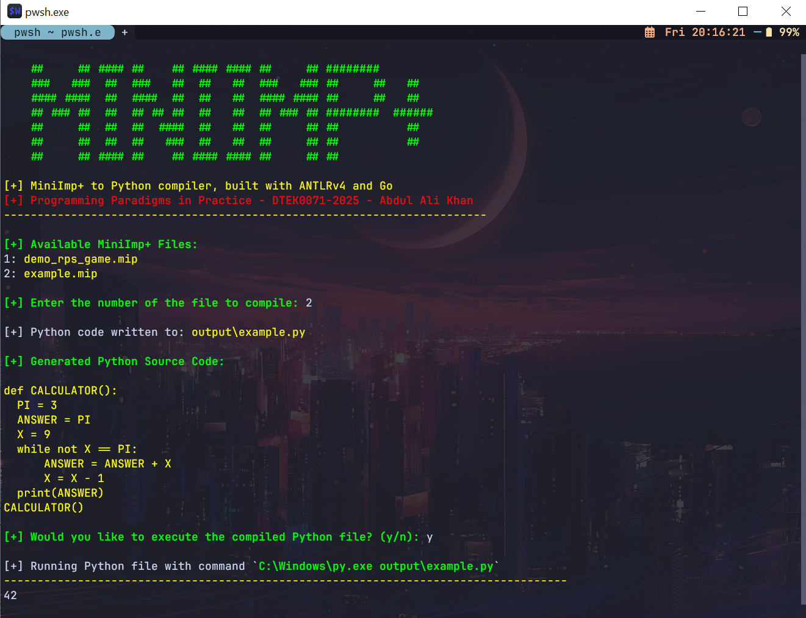
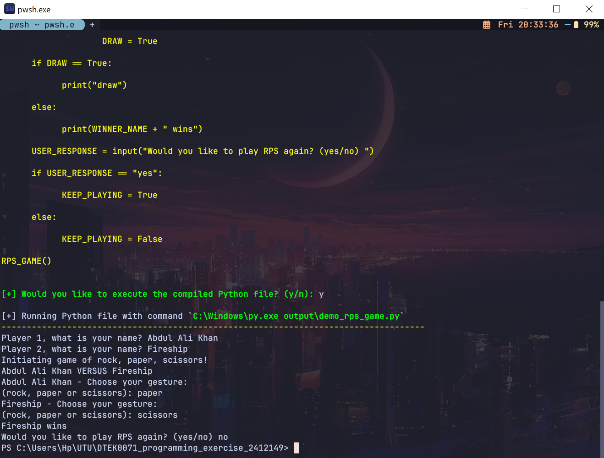

# MiniImp+ S2S Compiler
## A source-to-source compiler for the MiniImp+ language built with ANTLRv4

**Task:** Write a compiler that can compile programs written in a fictitious programming language (MiniImp+) into Python

### Introduction

This compiler compiles code written in MiniImp+ into a single backend language (Python) using Go and [ANTLRv4](https://github.com/antlr/antlr4). The parser and lexer classes were generated with ANTLR and these classes were implemented for custom code generation (MiniImp+ to Python) in Go.

I followed the visitor pattern in this exercise by implementing the `parser.MiniImpVisitor` class to traverse the parse tree generated
by ANTLR. Methods such as `VisitTerm`, `VisitExpr`, `VisitStmt`, `VisitIterat`, `VisitSelect`, etc. were implemented to handle specific types of nodes in the tree. I believe any new constructs added to the MiniImp+ grammar 
can be readily supported by this compiler through extension of the visitor since much of the implementation is encapsulated.

Two **MiniImp+** programs have been included with this project and they are both located in the root directory (same directory as this README).

- **example.mip** - this was the example that came with the original miniimp repository
- **demo_rps_game.mip** - this was the Rock, Paper, Scissors game described in the description of the programming exercise

### Description of main routines
I implemented the compiler in **Go** and the destination language is **Python**. The visitor pattern has been followed in traversing the ANTLR-generated parse tree for the extended grammar of MiniImp, as described in the exercise description.
Development work has been performed with Go version `go1.23.4 windows/amd64`. Support with older go engines has not been tested, thus it cannot be guaranteed.

Parsing is mainly done by the `antlr4-go` Go package. I have mainly implemented visitor methods to handle particular types of nodes during the parse-tree traversal. The default implementation in the package for visitors is to visit children nodes when
a node is visited. Nodes that needed to be specifically handled for Python,  such as assignments, loops, conditionals and function definitions override this default behavior. Generating appropriate Python syntax also required custom logic from my end to 
ensure that the indentation and variable scoping was generated correctly. Overall, this visitor implementation was pretty modular and should be extendable as new constructs are added to the MiniImp+ grammar.


Furthermore, there were many (sort-of) useful debugging print statements that have been purposefully left out as commented statements in the methods of the **Python Visitor** (see `visitors/py_visitor.go`). They can be uncommented to uncover outputs from the traversals of various node types if
the compiler behaves unexpectedly (though, ideally, it shouldn't).


### Overview of program operation
- The compiler can be used in either *direct mode* or *interactive mode*.
- **Direct mode:** When the MiniImp+ source file to compile is passed as an argument like `go run main.go example.mip`, the compiler generates the Python source in the `/output` folder directly.
- **Interactive mode (optional):** When no arguments are passed to the compiler (`go run main.go`), it runs in **interactive mode**.
  - In interactive mode, the compiler lists MiniImp+ files available in the current project directory.
  - A MiniImp+ source file can be selected from the menu and the compiler will then generate the equivalent Python source in the `\output` folder.
  - Upon successful compilation, the compiler will also output the Python source to the console.
  - Additionally, it will prompt the user if they would like to execute the Python code in the same console window **(optional)**.

### Usage instructions

This project requires **Go** and **ANTLRv4** to be installed on your system.

#### Installing Go dependencies
To install the necessary Go packages, run the following command while in the compiler project's directory:

```
go mod tidy
```

#### Running the compiler without building an executable
The compiler can be run without building an executable as follows:
```
go run main.go
```

#### Building and running an executable
A standalone executable can be built with
```
go build -o miniimpplus
```

To run the binary: `./miniimpplus`

#### Compiling MiniImp+ programs
If you would like to compile a specific MiniImp+ file directly, you can pass the filename as an argument as shown below:

```
go run main.go example.mip
```

#### Interactive mode
When you run the compiler without specifying any target source file, it opens up in **interactive mode**:

```
go run main.go
```

or

```
./miniimpplus
```



In this mode, the user is guided through menus and prompt messages and the workflow involves 
selecting a MiniImp+ source file, compiling it, seeing the output and then choosing whether to execute
the equivalent Python in the same console window.

Lastly, here is a screenshot of me playing rock, paper and scissors against Fireship: 

